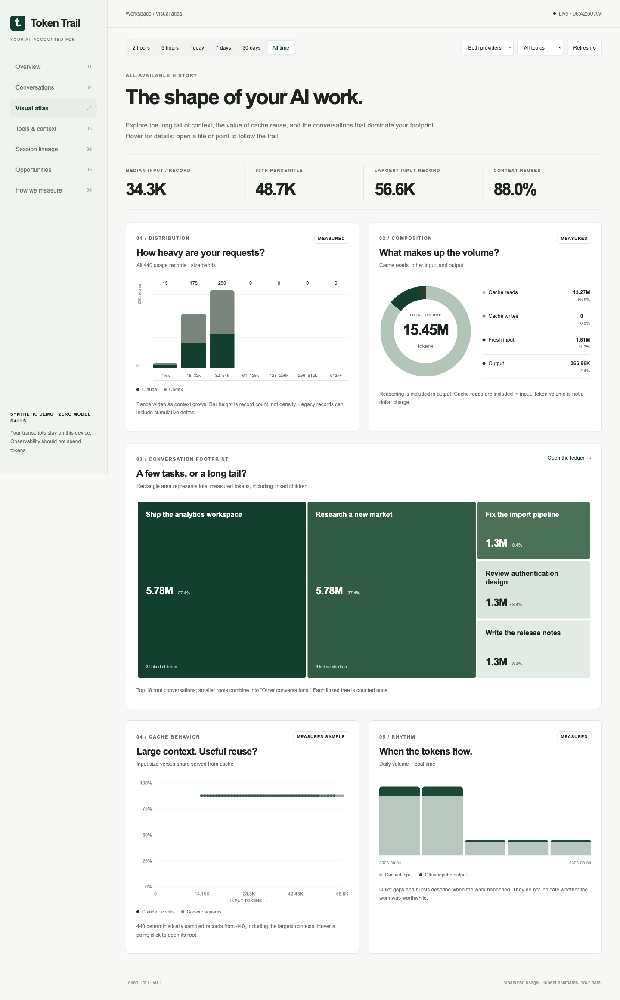

# Token Trail

**Follow every token back to the conversation that started it.**

Claude calls Codex. Codex starts three agents. One of them retries the same fetch ten times. Token Trail brings the usage back to the original task, so you can see the shape of the work—not just a daily total.

A local dashboard for **Claude Code and Codex logs**. Zero runtime dependencies. Zero model calls. No API key. No transcript uploads.



## Run from source

Requires Python 3.10 or newer. From this repository:

```sh
python3 -m token_trail serve
```

Open **http://127.0.0.1:8765**. The first import reads your local transcripts; the collector then checks for changes every five seconds. Claude Code and Codex do not need to be running for historical analysis.

Or install this checkout into your preferred Python environment:

```sh
python3 -m pip install .
token-trail serve
```

This is a source release; there is no implied public PyPI package or hosted service.

## What you get

- **One conversation, its whole tree.** Native children and evidenced cross-provider launches roll into their parent. Unknown ancestry stays unknown; edit relationships locally.
- **2h / 5h / today / 7d / 30d / all-time views**, filtered by provider and existing chat-library topics.
- **Cache-aware accounting**, output and reasoning splits, per-model totals, request activity and daily exports.
- **Tools, skills, images, repeated payloads and explicit error signals.** Measured counters and text-size estimates are visibly different.
- **An efficiency workbench.** Evidence-based opportunities and a context carry-forward simulator, without pretending every large number is waste.
- **Private-safe share export.** Aggregate numbers only; no names, paths, session IDs, prompts or topics.

Browser-only Claude/ChatGPT conversations and remote-machine transcripts are not collected automatically. Point an adapter at local copies of supported logs to analyze additional machines separately.

## Configuration and existing chat library

Copy `examples/config.json` to a private path, edit it, then run:

```sh
python3 -m token_trail --config data/config.json serve
```

`library` optionally points to a chat library's `data/` folder containing `index.json`, `enrich.json`, and `projects.json`. It is read-only. Token Trail reuses titles and assignments without generating its own AI labels. Without it, transcript titles are used and topics remain unassigned. Relative paths resolve against your current working directory; use absolute paths for a service.

The default database lives at `~/.local/share/token-trail/ledger.sqlite`. Set `TOKEN_TRAIL_DATA` to change its directory. The database contains local labels, paths, hashes and derived measurements; treat it as private even though it excludes full message bodies.

## Continuous collection and launch tracing

```sh
python3 scripts/install_local.py --config data/config.json --service --hooks
```

This adds a macOS LaunchAgent or Linux user service and optional identifier-only SessionStart hooks for both clients, preserving existing hooks and saving backups. Follow the printed service-start command. Hooks take effect in new sessions. Collection itself does not require hooks.

For an AI-launched cross-provider run, use an explicit parent identifier:

```sh
python3 -m token_trail --config data/config.json run \
  --parent claude:PARENT_SESSION_ID -- codex exec 'A bounded task'
```

The wrapper preserves stdin, stdout, arguments, exit status, and model selection. A SessionStart hook in the child links its ID to the launch trace. Native subagents need no wrapper. Claude’s SessionStart hook also uses its documented environment file to propagate the current session ID into later shell launches, and cross-provider inherited IDs are recognized automatically. Uninstrumented launches whose logs expose no parent remain unresolved; time proximity is not sufficient evidence.

See [the harness policy](docs/HARNESS.md) and [measurement contract](docs/MEASUREMENT.md).

## Diagnosis and data export

```sh
python3 -m token_trail scan
python3 -m token_trail report --hours 168
python3 -m token_trail report --json
python3 -m token_trail advise --session codex:THREAD_ID
python3 -m token_trail doctor
```

Use the same `--config` before the command when using a custom database. Reports read the indexed ledger; run `scan` first if the background service is stopped.

## Try it without personal logs

```sh
TOKEN_TRAIL_DATA=/tmp/my-token-trail-demo python3 -m token_trail demo
```

Run the command it prints. All demo sessions are fictional and the demo uses port 8766 and empty source roots.

## Trust the accounting, challenge the inference

Claude cache reads/writes are added to its uncached input. Codex cache reads are already part of input. Reasoning is already part of output. Streaming records and copied fork history must not be billed twice. The fixture suite covers these traps.

Tool text uses a characters/4 estimate. Images are occurrences, not exact image tokens. Activity categories are inferred from nearby tool calls; a request includes the rest of its context too. Cached reuse, delegation, and retries can all be worthwhile. No automatic model downgrading or forced compaction occurs.

See [security](SECURITY.md), [product direction](docs/PRODUCT.md), and [contributing](CONTRIBUTING.md).

## Development

```sh
python3 -m unittest discover -s tests -v
node --check token_trail/web/app.js
```

The runtime is Python standard library + static HTML/CSS/JavaScript. SQLite is a disposable derived ledger; source transcripts are never edited. The current collector reparses changed files rather than tails bytes, favoring correct handling of streaming updates and rewritten transcripts. Very large active logs may refresh more slowly than the five-second polling target.

MIT licensed. This project is independent of Anthropic and OpenAI.
